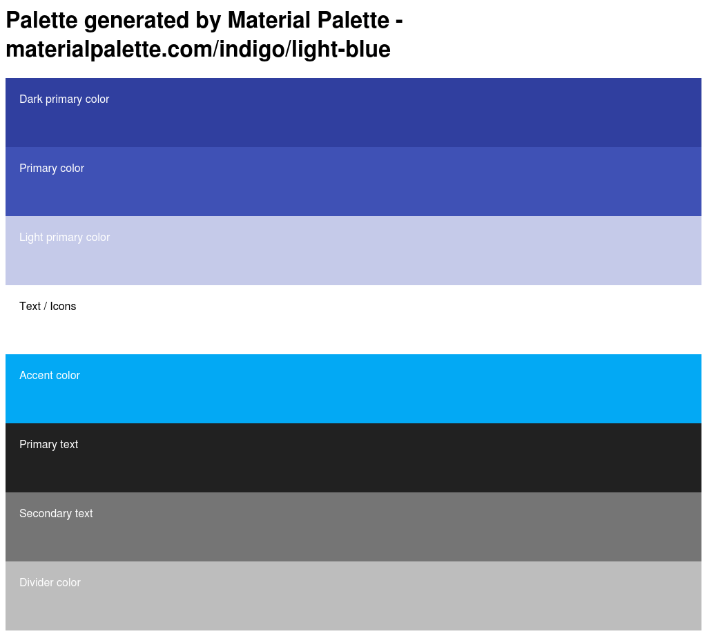
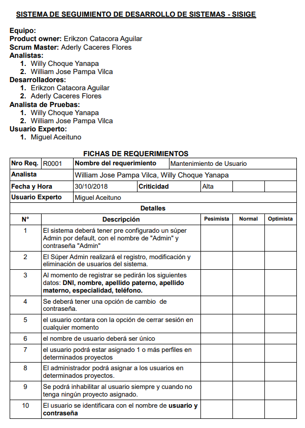
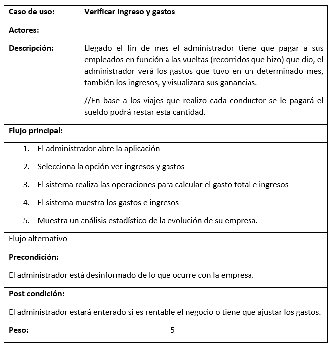

# Sistema de información de inventario y registro de incidentes

### Planteamiento del problema

El proceso de inventario de equipos de cómputo se realizaba, llenando de manera manual unos formatos impresos que posteriormente es recopilada en un archivo físico y digital (Excel) de todos los equipos con las que cuenta la Universidad, no se puede garantizar que dicho archivo Excel brinde los datos suficientes y necesarios para conocer el estado de estos equipos.
No hay registro adecuado de los componentes de un gabinete como el responsable la ubicación, número de serie etc., se necesita registrar eventos que sucedan con estos, como un …

### Objetivos
Se pretende desarrollar un sistema de Control de Inventario de Equipos de Cómputo de la UNAP, centrada en solucionar y mitigar la mayor cantidad de amenazas como perdida, imperfecto en las que pueda estar incurriendo los gabinetes… en la Universidad Nacional del Altiplano en su control de inventario, permitiendo lograr un alto nivel de satisfacción, integridad de la información y mejorar considerablemente en el tiempo de generar los reportes de manera oportuna y precisa.
Además de llevar un seguimiento del funcionamiento de estos equipos.

### Alcance. 
– Para este proyecto solo se tendrá en cuenta los gabinetes y aquellos equipos que contenga este, como un switch, …
EL uso que se le dara al software…
Como se va a usar, donde(lugar), en que situaciones

El lenguaje en el que será desarrollado dependerá si el sistema deberá ser
Plataforma 
WEB
DESKTOP
MOBIL

Conocer la infraestructura donde se va a desplegar

### Metodología y materiales. – 
Programación extrema XP y Scrum, según el texto “Scrum y xp desde las
De XP se tomara la programación en pares, para el backend y frontend, 2 para cada uno.

Trincheras” estas dos metodologías se pueden usar en conjunto tomando algunas premisas de cada una, ambos son metodologías agiles e iterativas.

Para la parte del diseño de … la interfaz se utilizaran las métricas de Material Design( son guias de diseño que ayudaran a que el web site se vea bien), utilizando los colores del logo del la OTI azul y celeste

Para mejorar la parte del desarrollo por el lado del BackEnd se utilizara Python con flask y por el lado del FrontEnd Vue.js con vuetify, vue router, 
Herramientas 
Webstorn IDE para desarrollo web con vue
PyCharn IDE para Python
O se puede utilizar el IDE Visual Studio 

ITIL…se tomara en cuenta la parte de ….

### Requerimientos
* Registro de equipos de red(inventariado)
* Registro de incidencias de los equipos de red
* Reporte… del estado de los equipos ,,,,(mostrar datos estadísticos de los sucesos con los equipos)

### Casos de Uso( diagrama)

* Funcionales. -Cosas que se pueden hacer con el sistema
    * Registrar ...
* No funcionales. -Características y/o restricciones en la implementación o estándares de calidad

### Otros Diagramas
#### Diagrama de secuencia, clases, despliegue, ER…
#### Cronograma de actividades (diagrama de gant)
#### Mockup del sitio web …
#### Costos… se omite

### Etapas
* Análisis
* Diseño
* Planificacion
* Implementaion
* Despliege
* Mantenimiento

Login
https://vuetifyjs.com/en/examples/layouts/centered

Site
https://vuetifyjs.com/en/examples/layouts/googleContacts

Example layouts
https://vuetifyjs.com/en/framework/pre-made-layouts

### Referencias

Packt Publishing
Flask By Example

O’Reilly Media
Flask web development

O’Reilly Media
Python Cookbook

HTTPS

Flask doc
VueJs doc
Vuetify doc

### TODO

Realizar un diagrama de despliege ... o del funcionamiento del programa.

Diagrama de Servicio rest

diagrama de consumo de ApiRest con VueJs u otro framework Web

# Doc

Se utilizara el azul por ser los colores representativos de la OTI que estan en el logo. 

Para el backend se creara una api rest, esto permitira a la aplicacion ser escalable, de forma que si posteriormente se quiere crear una aplicacion mobil o desktop solo tendra que consulta a la API REST, asi podra comunicarse con otros sistemas que necesiten los datos de este sistema.

Con esos datos en formato json,(datos )  se puede leer esos datos y crear un vista HTML, crear una app android, un UI para IOS.

REFERENCIA from
programador web valencia

### Diseño de la API Rest

#### Tabla de rutas para realizar un API Rest

Tabla de rutas para realizar un API Rest

Ruta	Método	Funcionalidad

/signup	                    POST	Registro
/auth/login	                POST	Inicio de sesión
/auth/logout	            GET	Cerrar sesión

/equipos                            Lista los equitos.
/equipos/equipo_001                 Obtiene detalles del equipo.
/equipos/equipo_001/incidentes      Obtieene la lista de incidentes con el equipo.

/biblioteca	                GET	Lista todas las bibliotecas
/biblioteca	                POST	Crea una nueva biblioteca
/biblioteca/45	            GET	Obtiene la biblioteca
/biblioteca/45	            PUT	Actualiza la biblioteca
/biblioteca/45	            DELETE	Borra la biblioteca
/biblioteca/45/libros	    GET	Lista todos los libros de la biblioteca
/biblioteca/45/libros/21	GET	Obtiene el libro de la biblioteca
/biblioteca/45/libros/21	PUT	Actualiza el libro de la biblioteca
/biblioteca/45/libros/21	DELETE	Borra el libro de la biblioteca

### Bibliotecas para Flask
Por supuesto, hay muchas y muy buenas. Las siguientes son las más detacables.

flask-restful: Sencilla forma de realizar un API Rest.

flask-restplus: Ampliación del anterior. Entre otras herramientas, tiene un generador de documentación.

flask-restless: Preparado para trabajar con SQLalchemy.

### Herramientas

El backEnd
Python con flask ide Pycharn

El frontEnd
Node JS con Vuejs ide WebStorn

Con el sistema de control de versiones git, usando su plataforma web GitHub.

En el backend se utilizara un ORM, 
en python hay varios, weno ni tantos , 4-5 ORMs
peewee, Pony ORM, SQLAlchemy, y SQLObject ademas esta el ORM de Django, pero este esta estrechamente ligado al framework Django, y tratar de desacoplarlo y hacer algunos hacks para integrarlo con flask puede tomar algo de tiempo. 

para este caso se utilizara peewee,porque al parecer es un orm estable, tiene soporte para MYSQL( REFERENCIA AL VIDEO COMPARACION ENTRE ORM EN PYTHON)

una campanita de notificaciones, la indicara la cantidad de equipos en estado malo.